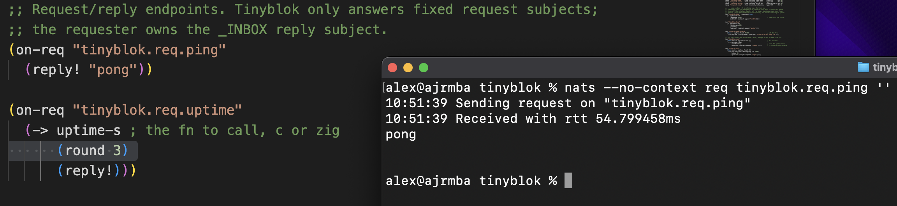
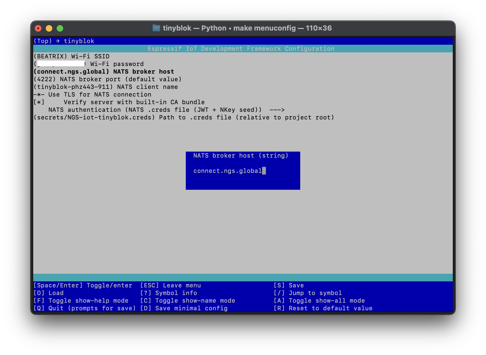

# tinyblok

ESP-IDF firmware for ESP32. It runs a tiny patchbay on-device and conditioned output to NATS. It is the _tiny_ counterpart to [lexvicacom/monoblok](https://github.com/lexvicacom/monoblok). [Intro blog post](https://alexjreid.dev/posts/tinyblok/).

## Status

- Connects to Wi-Fi, then NATS over TCP or TLS.
- Supports no auth, user/pass, or NATS `.creds` auth - **works with Synadia Cloud** and other operator mode clusters
- Publishes heap, RSSI, uptime, and temperature-derived subjects from [`patchbay.edn`](./patchbay.edn).
- You can configure Wi-Fi and NATS details with `make menuconfig`; ESP-IDF writes them to local `sdkconfig`.
- Run `make build flash`, then `make monitor` to try it on hardware.


## Patchbay Lite

Tinyblok is a firmware-sized patchbay for telemetry. Rules are compiled ahead
of time into deterministic Zig, run with fixed state, read local sensor pumps,
derive new subjects, answer fixed request/reply subjects, and publish the
results to NATS without allocating.

It is not trying to be a full monoblok runtime on an ESP32-C6. Runtime patch
loading, dynamic graph edits, JSON/event document processing, inbound bridges,
and fleet-management features are outside the current scope.

### What's there and not there

Tinyblok intentionally implements a static, numeric subset of monoblok's
patchbay. Supported forms include `when`, `->`, comparisons, `deadband`,
`squelch`, `moving-*`, `round`, `quantize`, `clamp`, `throttle`, edge
gates, `publish!`, `count!`, `bar!`, `sample!`, `debounce!`, `on-req`,
and `reply!`.

Not yet supported in Tinyblok: `if`, `do`, `transition`, `on-silence`,
`aggregate!`, JSON forms, string/subject builders beyond publish-target
`subject-append`, general arithmetic, `changed?`, `delta`, `hold-off`,
`rate`, `percentile`, `median`, `stddev`, `variance`, `min`, `max`,
`abs`, `sign`, `lvc`, and `bridge`.

>This does not mean never - some are trivial, some make no sense to even bother with (bridge, for instance is implicit). Others are tricky due to static code gen.

### Soundcheck

Running `bin/soundcheck` builds a native host CLI from the generated patchbay. It
reads newline-delimited `SUBJECT|payload` messages on stdin and writes emitted
messages to stdout in the same shape. Top-level inputs are passed through
first, followed by any patchbay emits:

```sh
printf 'tinyblok.temp|31\n' | ./soundcheck
printf 'tinyblok.temp|31\n' | ./soundcheck --label
printf 'tinyblok.rssi|-80\n' | ./soundcheck --label --linger-ms 1200
```

When stdin reaches EOF, `soundcheck` keeps pending timers alive for up to 10 s
by default, so `sample!`, `debounce!`, and wall-clock `bar!` rules can still
fire after piped input closes. Use `--linger-ms N` to change that window, or
`--linger-ms 0` to exit immediately after EOF.

See [`guide.md`](./guide.md) for the standalone `soundcheck` guide.

## Drivers

A driver is just a function named from [`patchbay.edn`](./patchbay.edn):

```clojure
(pump "tinyblok.temp" :from tinyblok_read_temp_c :type f32 :hz 1)
```

Codegen declares the function for Zig and adds it to a C pump table. [`main/c/drivers.c`](./main/c/drivers.c) arms one `esp_timer` per pump, posts onto `esp_event`, then calls back into Zig. Use C for IDF-heavy sources, Zig for dependency-free ones.

Request handlers can also call registered functions:

```clojure
(fn hello-c :from tinyblok_hello_c :input bytes :type bytes)

(on-req "tinyblok.req.hello-c"
  (reply! (hello-c payload)))
```

Registered function `:type` describes the return value. Optional `:input`
describes whether the function receives the current threaded value or request
payload. Omit `:input` for zero-argument reads.

Function shapes:

| Declaration | Shape | Use |
| --- | --- | --- |
| `:input bytes :type bytes` | request bytes in, reply bytes out | `(reply! (name payload))` |
| `:type u32` / `i32` / `f32` / `uptime-s` | zero-arg numeric read | numeric value |
| `:input u32` / `i32` / `f32`, scalar `:type` | threaded scalar transform | `(-> payload-float (name) ...)` |

For byte functions, codegen passes `payload_ptr`, `payload_len`, `out_ptr`, and
`out_len`; the function returns the number of reply bytes written. For scalar
input functions, codegen converts the current threaded `f64` into the declared
input type and formats the scalar return value.

## Request/reply

`on-req` declares fixed NATS service subjects that Tinyblok subscribes to after
every broker connect. The requester owns the `_INBOX` reply subject; Tinyblok
only parses the incoming `MSG` reply-to field and sends `reply!` back to it.
Replies can be inline literals, numeric rule results, the original request
payload, or the result of a registered `:input bytes :type bytes` function.

That keeps request handling static like the rest of Patchbay Lite: no arbitrary
runtime `SUB`, no generated inboxes, and no pending request table on-device.
The generated handler dispatches by subject and uses stack buffers for payload
parsing and function-backed replies.

This is useful for small control-plane actions that should not be continuous
telemetry: pinging a device, reading uptime, asking it to reload published
metadata, starting a sensor sweep, or triggering a one-shot diagnostic sample.
It also works naturally for fleet queries. If many devices subscribe to the
same request subject, one `nats req`-style request is effectively a broadcast:
each device receives the same request and replies to the requester's inbox.
Clients that expect fleet replies should wait for multiple responses rather
than stopping after the first one.

```clojure
(on-req "tinyblok.req.ping"
  (reply! "pong"))

(on-req "tinyblok.req.uptime"
  (-> uptime-s
      (round 3)
      (reply!)))

(on-req "tinyblok.req.hello-c"
  (reply! (hello-c payload)))
```

From a NATS client:

```sh
nats req tinyblok.req.ping ''
nats req tinyblok.req.uptime ''
nats req tinyblok.req.hello-c tinyhi
nats req tinyblok.req.hello-zig tinyhi
```



### How it fits together

[`tools/gen.py`](./tools/gen.py) compiles [`patchbay.edn`](./patchbay.edn) into [`main/zig/rules.zig`](./main/zig/rules.zig). The generated Zig is straight-line rule code with static state slots, which is much friendlier to a microcontroller than walking an s-expression tree at runtime.

The reusable ops live in [`main/zig/kernel.zig`](./main/zig/kernel.zig). That file is vendored from monoblok and should stay byte-identical; use `make sync-kernel` or `make sync-kernel-remote` when it changes upstream.

## TX ring

[`main/zig/tx_ring.zig`](./main/zig/tx_ring.zig) sits between rule eval and the NATS socket. `publish!` queues a subject/payload record; [`main/zig/main.zig`](./main/zig/main.zig) drains it through [`main/c/nats.c`](./main/c/nats.c). If Wi-Fi or the broker stalls, the ring drops the oldest samples rather than blocking rule evaluation.

## Why C and Zig

[`main/c/stub.c`](./main/c/stub.c), [`main/c/nats.c`](./main/c/nats.c), [`main/c/drivers.c`](./main/c/drivers.c), and [`main/c/sources.c`](./main/c/sources.c) own the ESP-IDF surface: Wi-Fi, NVS, sockets, TLS, timers, events, and sensors. Zig owns the portable patchbay path: generated rules, op kernels, and the publish queue.

That split keeps IDF macros out of `@cImport` and keeps the Zig side small enough to host-test with `make test`.

## make commands

Use the top-level [`Makefile`](./Makefile):

```sh
make gen
make soundcheck
make test
make build
make flash
make monitor
make menuconfig
```



Checked-in defaults belong in [`sdkconfig.defaults`](./sdkconfig.defaults); local choices live in `sdkconfig`. Real secrets do not: use [`secrets/nats.creds.example`](./secrets/nats.creds.example) as the local `.creds` template.
