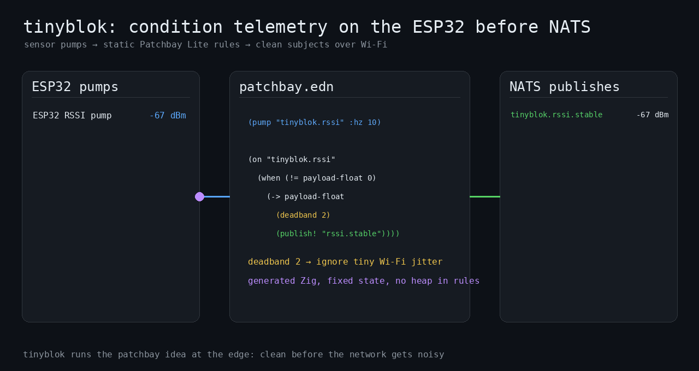
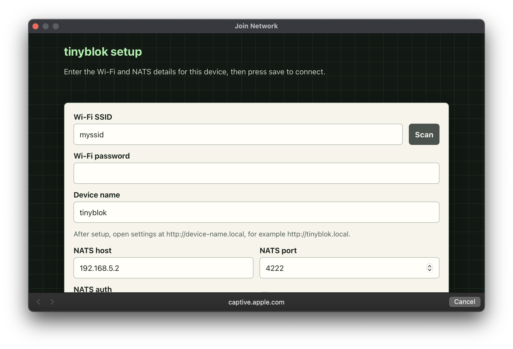
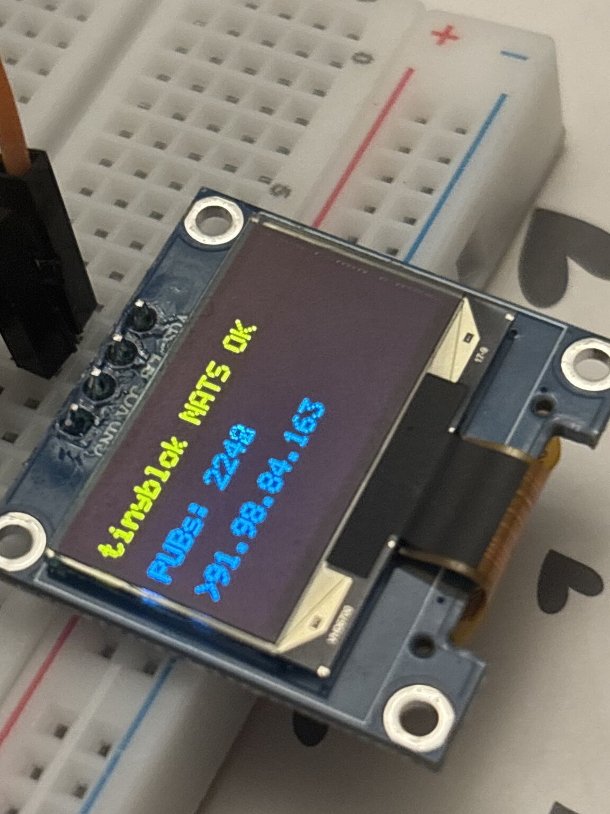

# tinyblok

Runs a message conditioning  _patchbay_ (see below animation) on ESP32 boards, and publishes conditioned sensor streams to NATS. It is the miniature counterpart to [lexvicacom/monoblok](https://github.com/lexvicacom/monoblok) - take a look for more context, or read the [tinyblok intro blog post](https://alexjreid.dev/posts/tinyblok/).



## Install

The fastest path is browser-based flashing: open <a href="https://flash.monoblok.host" target="_blank" rel="noopener">flash.monoblok.host</a> in Chrome or Edge, plug the board in over USB, and pick a port.

To build and flash from source:

```sh
make build
make flash
make monitor
```

`make flash` auto-detects the serial port; pass `PORT=/dev/cu.usbmodem101`
(or similar) to override. ESP-IDF must be installed; see
[make commands](#make-commands) below for `IDF_PATH` / `IDF_EXPORT` overrides.

Exit `make monitor` with **Ctrl+]** (Ctrl+C is trapped by the monitor).

## First-time setup

After flashing, the device boots into a captive setup portal. No serial
console or pre-baked credentials are needed.

1. Join the `TINYBLOK` Wi-Fi network advertised by the device.
2. The captive portal should open automatically. If it does not, open `http://10.42.0.1`.



3. Enter Wi-Fi, device name, and NATS settings.
4. Save. Tinyblok attempts the Wi-Fi connection, stores the config as valid on success, and reboots.
5. Now configured, the settings page is available at `http://tinyblok.local` by default. If you set the device name to `kitchen`, open `http://kitchen.local`.

The device name is used as the mDNS hostname after setup. Use simple letters,
numbers, spaces, underscores, or hyphens; firmware normalizes it to a
lowercase `.local` hostname with hyphens.


## What it does

- Connects to Wi-Fi, then NATS over TCP or TLS.
- Supports no auth, user/pass, or NATS `.creds` auth - **works with Synadia Cloud** and other operator mode clusters.
- Publishes heap, RSSI, uptime, and temperature-derived subjects from [patchbay.edn](./patchbay.edn).
- Can optionally render device status on attached LCD/OLED displays, including NATS connection status and publish counters.
- Runtime Wi-Fi and NATS settings are stored in NVS and editable later over HTTP.




## Changing settings later

Open `http://<device-name>.local` on the same LAN, for example
`http://tinyblok.local` or `http://kitchen.local`. Use that page to change
Wi-Fi, device name, and NATS settings. The page saves settings to NVS; reboot
from the page if a change needs a clean reconnect.

The same API is available on the LAN:

- `GET /api/status`
- `GET /api/settings`
- `GET /api/wifi-scan`
- `POST /api/settings`
- `POST /api/reboot`
- `POST /api/factory-reset`

For example:

```sh
curl http://tinyblok.local/api/status
curl -X POST http://tinyblok.local/api/reboot
```

## Factory reset

Use the setup/settings page button or `POST /api/factory-reset`. This erases
the `tinyblok` NVS namespace and restores the setup portal on reboot. There is
no dedicated boot button hook yet because this board support does not currently
define a user button GPIO.

For a full serial reset while developing:

```sh
make erase-flash-monitor
```

## Patchbay Lite

Tinyblok is a firmware-sized patchbay for telemetry. It embeds a C patchbay
parser/evaluator derived from monoblok, reads local sensor pumps, derives new
subjects, answers fixed request/reply subjects, and publishes results to NATS.

It is not trying to be a full monoblok runtime on an ESP32-C6. Runtime patch
loading, dynamic graph edits, JSON/event document processing, inbound bridges,
and fleet-management features are outside the current scope.

### What's there and not there

Tinyblok uses monoblok's C parser/evaluator for normal `(on ...)` rules, with a
small Tinyblok layer for `(pump ...)`, `(fn ...)`, `(on-req ...)`, and `reply!`.
Top-level `lvc` and `bridge` forms are parsed by the vendored core but are not
wired into firmware policy.

### Soundcheck

Running `make soundcheck` builds a host C validator and checks
[patchbay.edn](./patchbay.edn) with the vendored parser/evaluator.

## Drivers

A driver is just a function named from [patchbay.edn](./patchbay.edn):

```clojure
(pump "tinyblok.temp" :from tinyblok_read_temp_c :type f32 :hz 1)
```

After you add the implementation, add the C symbol to the native symbol table in
[main/c/tinyblok_patchbay.c](./main/c/tinyblok_patchbay.c), then declare it in
[patchbay.edn](./patchbay.edn). [main/c/drivers.c](./main/c/drivers.c) arms one
`esp_timer` per parsed pump and posts onto `esp_event`.

Put small user-owned implementations in [main/c/user.c](./main/c/user.c), or in
another C file already listed by [main/CMakeLists.txt](./main/CMakeLists.txt).

Then reference the exported symbol from [patchbay.edn](./patchbay.edn). There
is no separate runtime registry; `(pump ...)` registers a timed source,
`(fn ...)` registers a callable C function, and `(on-req ...)` registers a
NATS request subject. The Tinyblok native symbol table is intentionally
explicit because C has no reflection over linked function names.

Pump source shapes are zero-argument reads:

| `:type` | C shape |
| --- | --- |
| `u32` | `uint32_t name(void)` |
| `i32` | `int name(void)` |
| `f32` | `float name(void)` |
| `u64` / `uptime-s` | `uint64_t name(void)` |

Request handlers can also call registered functions:

```clojure
(fn hello-c :from tinyblok_hello_c :input bytes :type bytes)

(on-req "tinyblok.req.hello-c"
  (reply! (hello-c payload)))
```

An `on-req` handler is patchbay code, not another compiled symbol. Declare any
C helper it needs with `(fn ...)`, then call that DSL name inside the handler.

Registered function `:type` describes the return value. Optional `:input`
describes whether the function receives the current threaded value or request
payload. Omit `:input` for zero-argument reads.

Function shapes:

| Declaration | Shape | Use |
| --- | --- | --- |
| `:input bytes :type bytes` | request bytes in, reply bytes out | `(reply! (name payload))` |
| `:type u32` / `i32` / `f32` / `uptime-s` | zero-arg numeric read | numeric value |
| `:input u32` / `i32` / `f32`, scalar `:type` | threaded scalar transform | `(-> payload-float (name) ...)` |

For byte functions, the runtime passes `payload_ptr`, `payload_len`, `out_ptr`,
and `out_len`; the function returns the number of reply bytes written.

## Request/reply

`on-req` declares fixed NATS service subjects that Tinyblok subscribes to after
every broker connect. The requester owns the `_INBOX` reply subject; Tinyblok
only parses the incoming `MSG` reply-to field and sends `reply!` back to it.
Replies can be inline literals, numeric rule results, the original request
payload, or the result of a registered `:input bytes :type bytes` function.

That keeps request handling static like the rest of Patchbay Lite: no arbitrary
runtime `SUB`, no generated inboxes, and no pending request table on-device.
The generated handler dispatches by subject and uses stack buffers for payload
parsing and function-backed replies.

This is useful for small control-plane actions that should not be continuous
telemetry: pinging a device, reading uptime, asking it to reload published
metadata, starting a sensor sweep, or triggering a one-shot diagnostic sample.
It also works naturally for fleet queries. If many devices subscribe to the
same request subject, one `nats req`-style request is effectively a broadcast:
each device receives the same request and replies to the requester's inbox.
Clients that expect fleet replies should wait for multiple responses rather
than stopping after the first one.

```clojure
(on-req "tinyblok.req.ping"
  (reply! "pong"))

(on-req "tinyblok.req.uptime"
  (-> uptime-s
      (round 3)
      (reply!)))

(on-req "tinyblok.req.hello-c"
  (reply! (hello-c payload)))
```

From a NATS client:

```sh
nats req tinyblok.req.ping ''
nats req tinyblok.req.uptime ''
nats req tinyblok.req.hello-c tinyhi
nats req tinyblok.req.hello-c17 tinyhi
```


### How it fits together

`patchbay.edn` is embedded into the firmware image by CMake and parsed once at
boot. The parsed tree is arena-owned; long-lived rule state is held by
`pb_eval_state`.

## TX ring

[main/c/tinyblok_tx_ring.c](./main/c/tinyblok_tx_ring.c) sits between rule eval
and the NATS socket. `publish!` queues a subject/payload record; the C main loop
drains it through [main/c/nats.c](./main/c/nats.c). If Wi-Fi or the broker
stalls, the ring drops the oldest samples rather than blocking rule evaluation.

## Why C

[main/c/stub.c](./main/c/stub.c), [main/c/nats.c](./main/c/nats.c),
[main/c/drivers.c](./main/c/drivers.c), [main/c/sources.c](./main/c/sources.c),
and [main/c/patchbay](./main/c/patchbay) keep the firmware in one C17-friendly
language boundary. The host test path builds the same patchbay C files used by
firmware.

## make commands

Use the top-level [Makefile](./Makefile):

```sh
make gen
make soundcheck
make test
make nats-host-smoke
make build
make flash
make monitor
make menuconfig
```

Run these from a shell where ESP-IDF is already exported, install ESP-IDF at
`$(HOME)/esp-idf-v6.0.1`, or pass `IDF_PATH=/path/to/esp-idf` or
`IDF_EXPORT=/path/to/esp-idf/export.sh`. For hardware commands, leave `PORT`
unset for ESP-IDF auto-detection or pass a serial device, for example
`make flash PORT=/dev/cu.usbmodem101`. You can also put machine-local
overrides in ignored `local.mk`.

`make nats-host-smoke` exercises the host-built C NATS client against a local
broker. It starts `nats-server` on `127.0.0.1:4223`, verifies request/reply on
`tinyblok.req.ping`, then verifies a five-message publish batch on
`tinyblok.host.pub`.

It needs `nats-server`, the `nats` CLI, and `cc` in `PATH`. Override the
test broker port with `NATS_HOST_PORT` if `4223` is already in use:

```sh
make nats-host-smoke
make nats-host-smoke NATS_HOST_PORT=4224
```
